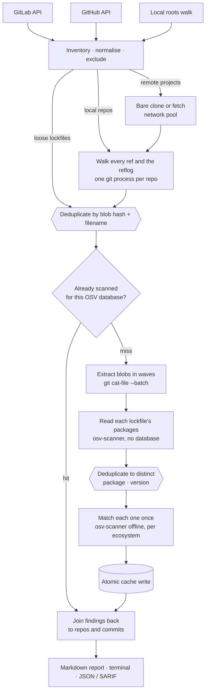

# lockaudit

[](go.mod)
[](https://github.com/Striffly/lockaudit/releases)
[](LICENSE)
[](https://github.com/Striffly/lockaudit/stargazers)
[](https://github.com/Striffly/lockaudit/issues)
[](https://github.com/Striffly/lockaudit/commits)
[](go.mod)

Audits **every version of every lockfile that has ever existed** in your
projects against the OSV vulnerability and malware databases.

The point is the history. A compromised package that you installed in 2023 and
updated away in 2024 is invisible to any scanner that looks at `HEAD` — but the
`postinstall` script already ran on your machine back then. This tool finds
those, tells you which commits carried them and when, and separates
**malware** (`MAL-*`, an active compromise) from ordinary vulnerabilities.

It scans three sources and deduplicates across them: your local machine, your
GitLab projects and your GitHub repositories, each forge via its API. Locally it
picks up git repositories (full history) *and* lockfiles that belong to no repo
at all (current state only) — the unpacked directory someone ran `npm install`
in and never committed is exactly where a compromised dependency hides.

> **Scope limit, stated plainly:** this tool audits *dependencies*, not your
> machine. A malware finding tells you a malicious package was in your tree; it
> cannot tell you whether anything executed, and a clean report is not evidence
> that your host is clean.

## How it works



Nothing runs in phases: local repos are already being walked while the remote
clones are still downloading, and each stage feeds the next as results arrive.

Three ideas make it affordable, and they are all the same idea applied at a
different grain. History is deduplicated to **distinct lockfile contents**
rather than commits. Those contents are deduplicated again to **distinct
packages**, because ten years of one lockfile is the same few hundred
dependencies over and over — measured at 35 distinct packages per thousand
entries on one real history. And results are cached by content hash, so the
same `package-lock.json` shared by forty commits, three repos and two forges is
scanned once, ever.

Why, and what each costs, is in [docs/adr/](docs/adr/).

## Install

Requires **Go ≥ 1.24**, **git**, and **osv-scanner ≥ 2.0**.

```sh
go build -o bin/lockaudit ./cmd/lockaudit
# or install into $GOPATH/bin
go install ./cmd/lockaudit
```

## Configure

```sh
cp .env.example .env    # every setting, commented
$EDITOR .env
```

Precedence: **CLI flags > environment > `.env` > defaults**. The file is
optional — a one-off run needs none:

```sh
GITHUB_TOKEN=ghp_… ./bin/lockaudit --github-only
```

Set `SOURCES` (any combination of `gitlab`, `github`, `local`), `LOCAL_ROOTS`,
and a token per forge:

| Forge | Where | Scopes |
|---|---|---|
| GitLab | Settings → Access Tokens | `read_api` + `read_repository` |
| GitHub | Settings → Developer settings → Tokens | classic `repo`, or fine-grained Contents + Metadata, read-only |

Tokens are never written to a repo config and are scrubbed from every log line
and error message.

## Use

```sh
# See what would be scanned, without scanning anything
./bin/lockaudit --dry-run

# Full audit
./bin/lockaudit

# Local only, lower the bar, export for CI
./bin/lockaudit --local-only --severity MODERATE \
    --json report.json --sarif report.sarif
```

`--severity` / `SEVERITY_THRESHOLD` is a **minimum**: everything at that level
and above is reported. The scale is
`ALL < LOW < MODERATE < HIGH < CRITICAL < MALWARE`, so `HIGH` reports HIGH and
CRITICAL, and `CRITICAL` reports CRITICAL only. Malware (`MAL-*`) sits above
CRITICAL and always surfaces whatever the threshold — set `MALWARE` to report
nothing else, or `ALL` to include advisories that carry no severity at all.

Exit codes: `0` clean, `1` findings at or above the threshold, `2` configuration
or fatal error, `130` interrupted with nothing found. Findings win over the
interruption — a run that saw malware exits `1` even if it was cut short.

### Output

Three destinations, and the first is the one that matters:

| | |
|---|---|
| `--report FILE` | **Markdown report, written by default** to `./lockaudit-report.md` (`REPORT_FILE` to change it, `--report -` to disable). The complete record: every commit of every occurrence, every failed unit, the malware checklist. Terminal scrollback is not where you re-read a finding next week. |
| stdout | A readable summary of the same thing, truncated to fit a screen. |
| `--json` / `--sarif` | For CI and code-scanning dashboards. |

A progress line on stderr shows the current stage, a bar and the elapsed time —
walking a decade of history is otherwise minutes of silence, and silence looks
like a hang. It is disabled automatically when stderr is not a terminal, and by
`--no-progress`. Logs and the report never fight over the line.

### Interrupting a run

`Ctrl-C` is safe and cheap. The run stops, and you still get a report of
everything scanned so far, clearly marked partial and stating how many lockfile
versions were never looked at — an incomplete scan is never presented as a
clean one.

Nothing is lost: every result is written to the cache the moment it is
produced, so rerunning the same command resumes rather than starting over. On a
cold 14-repo scan that is 23s the first time and 0.08s the second.

## Safety

Your repositories are never modified. The only git operations run against them
are `remote -v`, `log`, `ls-tree` and `cat-file`. Bare clones, extracted blobs
and scan results live in `~/.cache/lockaudit/`, never in your projects.

Failures are contained: an unreadable repo, a broken submodule, an expired
token, an archived or empty project are logged and counted, and the run
continues. The report lists them, so partial coverage is visible rather than
silent.

## Documentation

- [docs/adr/](docs/adr/) — the design decisions and what they trade away.
- [docs/osv-scanner-behaviour.md](docs/osv-scanner-behaviour.md) — verified
  quirks of the scanner this builds on.

## Test

```sh
go vet ./... && go test ./...
```

No network and no fixtures to install: `TestHistoryWalk` builds a real
repository, changes a lockfile twice, and checks every version is recovered
with its commits — including the two that only exist in the past.

## Star history

<a href="https://star-history.com/#Striffly/lockaudit&Date">
  
</a>

## Contributing

Issues and pull requests welcome. Before changing a design decision, read the
matching [ADR](docs/adr/) — several of them are deliberate trades that look
like bugs from the outside. Commits follow gitmoji + English imperative
(`✨ Add SARIF export`).

## License

MIT — see [LICENSE](LICENSE).
